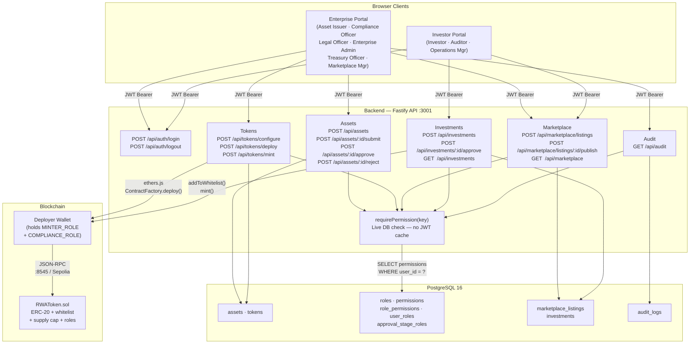
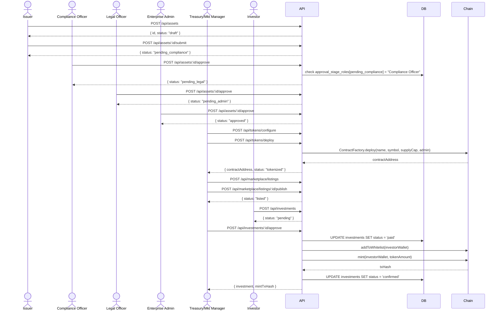
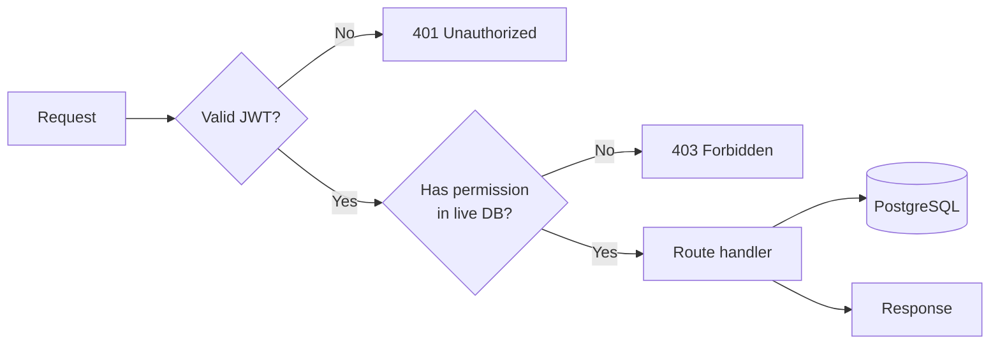

# Architecture Overview

## System Components

| Component | Technology | Responsibility |
|-----------|-----------|----------------|
| **Enterprise Portal** | Next.js 14 App Router | Asset issuance wizard, approval queue, token management, audit log |
| **Investor Portal** | Next.js 14 App Router (same app, permission-gated views) | Marketplace browse, investment submission, portfolio view |
| **Backend API** | Fastify 4 · TypeScript · Prisma | REST API, JWT auth, RBAC enforcement, business logic, blockchain orchestration |
| **Database** | PostgreSQL 16 | Persistent relational storage — assets, tokens, investments, listings, audit logs, RBAC tables |
| **Blockchain Service** | ethers.js v6 (inside backend) | Deploys RWAToken, manages whitelist, mints tokens via deployer wallet |
| **RWAToken Contract** | Solidity 0.8.24 · OpenZeppelin 5 | ERC-20 with supply cap, whitelist enforcement, role-based mint/burn/pause |
| **EVM Chain** | Hardhat (local, chain 31337) / Sepolia (testnet, chain 11155111) | Transaction settlement |

---

## High-Level Component Diagram

---

## Asset Lifecycle Data Flow

---

## Permission Check Flow

Every protected route runs `requirePermission(key)` as a Fastify `preHandler`:

> **Key property**: permissions are queried from the DB on every request. Revoking a role takes effect immediately — no JWT expiry required.

---

## Security Considerations

| Concern | Approach |
|---------|----------|
| Permission bypass | Live DB check via `requirePermission`; JWT carries no permissions |
| Cross-org access | All queries scope by `organization_id`; returns 403 (not 404) on cross-org |
| Blockchain key management | `DEPLOYER_PRIVATE_KEY` in env; production should use KMS/HSM |
| JWT storage | In-memory React Context only — no localStorage/sessionStorage |
| Token whitelist | `addToWhitelist` required before any `mint` or transfer; enforced on-chain |
| Audit trail | Every lifecycle event written to `audit_logs` with `previous_state` + `new_state` JSONB |
| Mint safety | `paid` status committed to DB before on-chain ops; failed mint leaves recoverable state |
