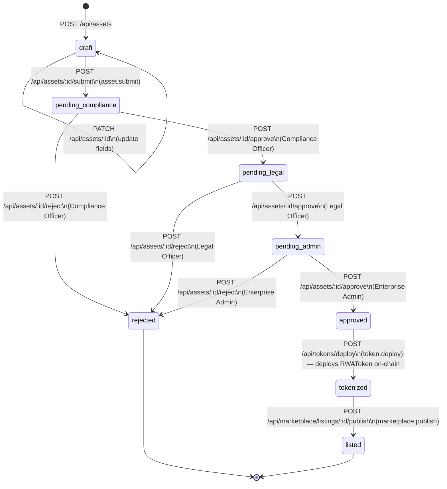
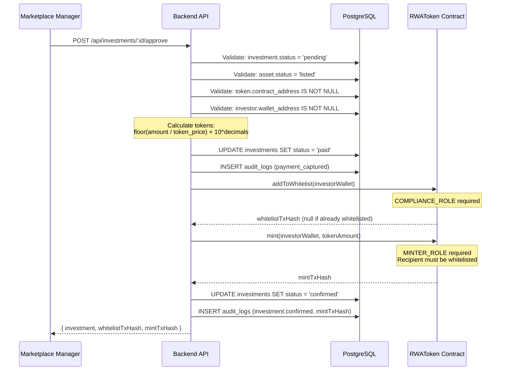

# Tokenization

## Asset Lifecycle State Machine

Assets move through a linear approval pipeline before they can be tokenized and listed. The state transition is enforced server-side and cannot be skipped.



### Status Descriptions

| Status | Description | Valid Next Statuses |
|--------|-------------|-------------------|
| `draft` | Created by Asset Issuer. Editable. | `pending_compliance`, (stay `draft`) |
| `pending_compliance` | Awaiting Compliance Officer review. | `pending_legal`, `rejected` |
| `pending_legal` | Awaiting Legal Officer sign-off. | `pending_admin`, `rejected` |
| `pending_admin` | Awaiting Enterprise Admin final approval. | `approved`, `rejected` |
| `approved` | All three approval stages passed. Token can now be configured and deployed. | `tokenized` |
| `rejected` | Rejected at any stage. Terminal state. | — |
| `tokenized` | ERC-20 contract deployed on-chain. `contract_address` populated in `tokens` table. | `listed` |
| `listed` | Marketplace listing published. Investors can submit investments. | — |

---

## Token Configuration vs. Deployment

Token lifecycle has two separate API calls:

### Step 1 — Configure (`POST /api/tokens/configure`)

Sets the token's off-chain parameters **before** deployment. Can only be called when the asset is `approved`.

| Field | Type | Notes |
|-------|------|-------|
| `tokenSymbol` | string | e.g. `GBOND` (max 8 chars) |
| `totalSupply` | integer | **Whole-token units** — e.g. `1000000` for one million tokens |
| `decimals` | integer | Default `18`; standard ERC-20 |
| `price` | decimal | Price per token in asset currency |
| `chainId` | integer | `31337` (Hardhat local) or `11155111` (Sepolia) |

> **Important**: `totalSupply` is passed as whole-token units (e.g. `1000000`). The `RWAToken` constructor multiplies by `10^decimals` internally to set the `supplyCap`. **Do not divide by `1e18`** before passing — that would set an effective supply cap near zero.

### Step 2 — Deploy (`POST /api/tokens/deploy`)

Calls `ethers.ContractFactory.deploy()` using the configured parameters. The deployer wallet (from `DEPLOYER_PRIVATE_KEY`) becomes the contract admin and receives all four on-chain roles:

| On-chain Role | Role ID | Capability |
|--------------|---------|------------|
| `DEFAULT_ADMIN_ROLE` | `0x00` | Grant/revoke other roles |
| `MINTER_ROLE` | `keccak256("MINTER_ROLE")` | Call `mint()` |
| `COMPLIANCE_ROLE` | `keccak256("COMPLIANCE_ROLE")` | Call `addToWhitelist()` / `removeFromWhitelist()` |
| `PAUSER_ROLE` | `keccak256("PAUSER_ROLE")` | Call `pause()` / `unpause()` |

After deployment, the asset status advances to `tokenized` and `tokens.contract_address` is set.

---

## RWAToken Contract

**Contract**: `contracts/contracts/RWAToken.sol`  
**Standard**: ERC-20 (OpenZeppelin 5.x)  
**Solidity**: 0.8.24 · Optimizer: 200 runs

### Constructor

```solidity
constructor(
    string  memory name_,
    string  memory symbol_,
    uint256        supplyCap_,   // whole-token units — constructor multiplies × 10^decimals
    address        admin_        // receives all four roles
)
```

### Whitelist Enforcement

The whitelist is enforced in the `_update` hook (OpenZeppelin 5.x replaces `_beforeTokenTransfer`):

| Transfer type | Whitelist check |
|--------------|----------------|
| Mint (`from = address(0)`) | `to` must be whitelisted |
| Transfer | Both `from` AND `to` must be whitelisted |
| Burn via `burn()` | `from` must be whitelisted |
| Burn via `adminBurn()` | No whitelist check (admin action) |

This means revoking a holder's whitelist status also blocks them from sending tokens — not just receiving.

### Key Functions

| Function | Required Role | Description |
|----------|--------------|-------------|
| `mint(to, amount)` | `MINTER_ROLE` | Mint `amount` wei to `to` (must be whitelisted) |
| `burn(amount)` | Caller whitelisted | Caller burns own tokens |
| `adminBurn(from, amount)` | `MINTER_ROLE` | Admin burns from any address |
| `addToWhitelist(account)` | `COMPLIANCE_ROLE` | Whitelist an address |
| `removeFromWhitelist(account)` | `COMPLIANCE_ROLE` | Remove from whitelist |
| `pause()` | `PAUSER_ROLE` | Pause all transfers |
| `unpause()` | `PAUSER_ROLE` | Resume transfers |

---

## Investment → Token Allocation Flow



### Recovery from Failed Mint

If the on-chain step fails (network error, gas, contract revert):

1. The investment remains at `status = 'paid'` — payment is captured, not lost
2. The API returns `502 Bad Gateway` with the blockchain error message
3. Ops can investigate the error and retry `POST /api/investments/:id/approve`
4. `addToWhitelistOnChain` is idempotent — it checks current whitelist state before submitting a tx

---

## Token Amount Precision

All amounts at the API boundary:

| Field | Unit | Example |
|-------|------|---------|
| `token.total_supply` (DB) | Whole tokens | `1000000` |
| `token.price` (DB) | Asset currency per token | `1.00` |
| `POST /api/tokens/configure` body `totalSupply` | Whole tokens | `1000000` |
| `POST /api/tokens/mint` body `amount` | Wei (string) | `"1000000000000000000"` |
| `investment.amount` (DB) | Asset currency (NUMERIC) | `50000.00` |
| On-chain `mint(to, amount)` | Wei (`uint256`) | `1000000000000000000` |

> **Why string for wei?** JavaScript `number` has 53-bit precision. `uint256` can represent values up to `2^256 − 1`. Passing large token amounts as strings prevents silent precision loss.
